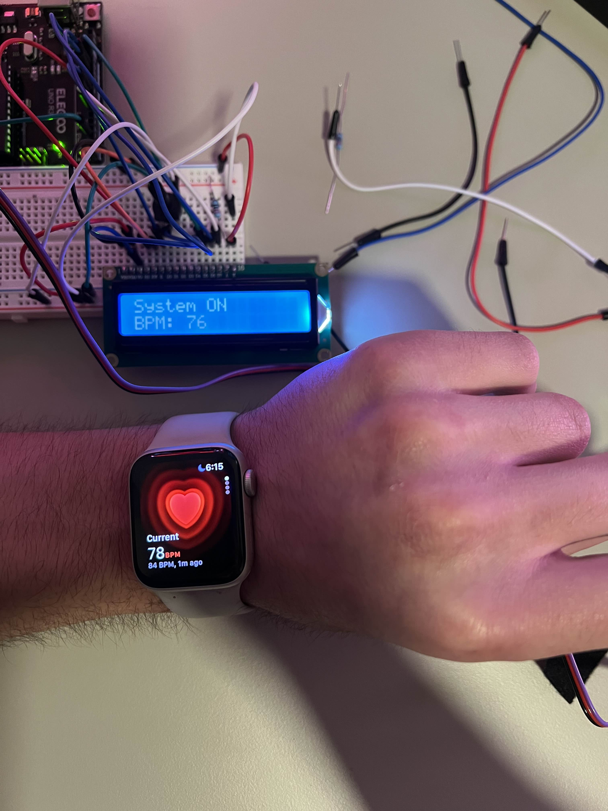

# Arduino Heart Rate Monitor

This project is an Arduino-based heart rate monitor/PPG machine that uses a PulseSensor to detect heartbeat and display the BPM on a 16x2 LCD screen.  
An IR remote controls the system power, while LEDs and a buzzer provide feedback based on your heart rate range.

---

## Demo

Here’s a comparison of my Arduino heart rate and an Apple Watch:

  

---

## Features
- Measures heart rate using the PulseSensor  
- Displays BPM on LCD  
- IR remote toggles system on/off  
- LEDs and buzzer indicate heart rate zones  

---

## Components
- Arduino Uno  
- PulseSensor PPG Scanner  
- 16x2 LCD Display  
- IR Receiver + Remote  
- 3 LEDs (Red, Yellow, Green)  
- Active Buzzer  
- Jumper Wires / Breadboard  

---

## Pin Setup

| Component | Pin |
|------------|-----|
| LCD RS | 7 |
| LCD E | 8 |
| LCD D4 | 12 |
| LCD D5 | 13 |
| LCD D6 | 11 |
| LCD D7 | 6 |
| IR Receiver | 2 |
| PulseSensor | A0 |
| Red LED | 4 |
| Yellow LED | 9 |
| Green LED | 10 |
| Buzzer | 3 |

---

## Heart Rate Indicators

| Range (BPM) | Indicator |
|--------------|------------|
| 65–90 | Green LED |
| 60–65 or 90–100 | Yellow LED |
| <60 or >105 | Red LED + Buzzer |

---

## Libraries Used
- `IRremote`
- `PulseSensorPlayground`
- `LiquidCrystal`
